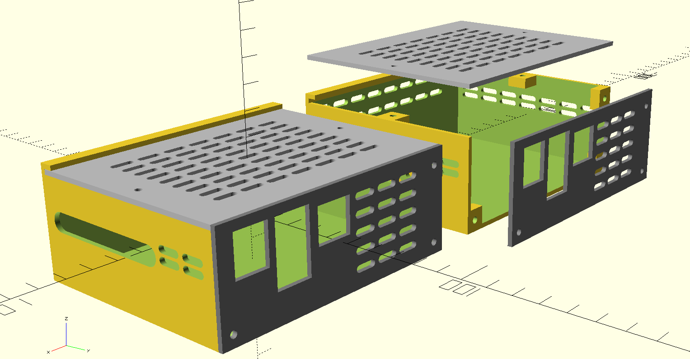
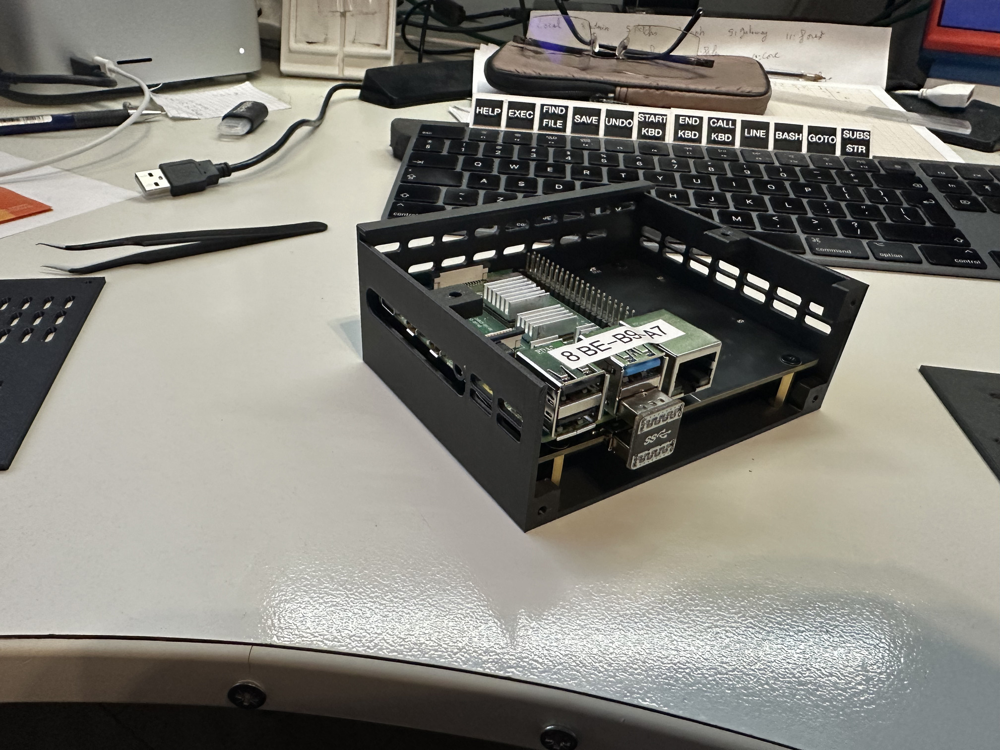
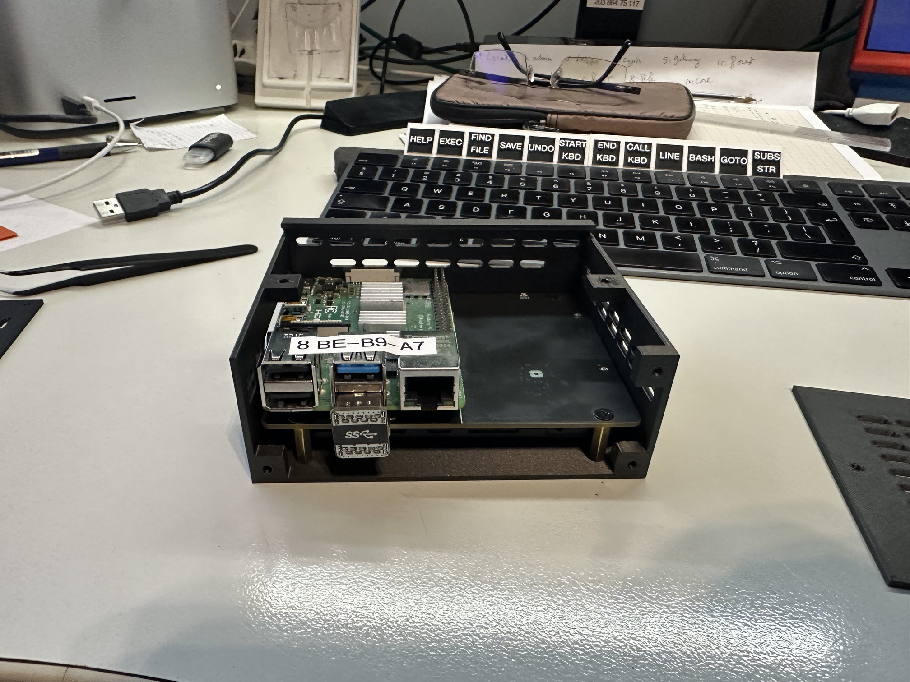
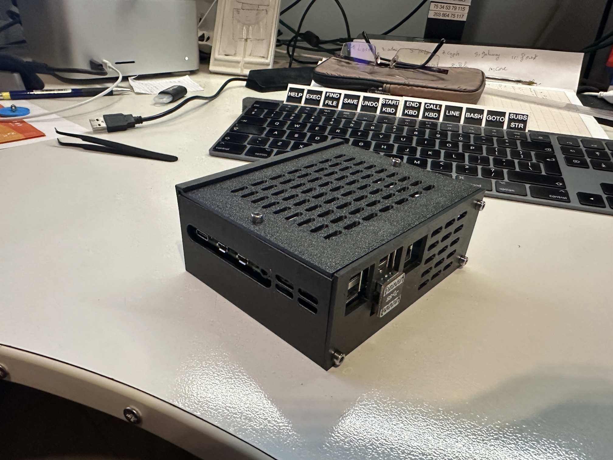
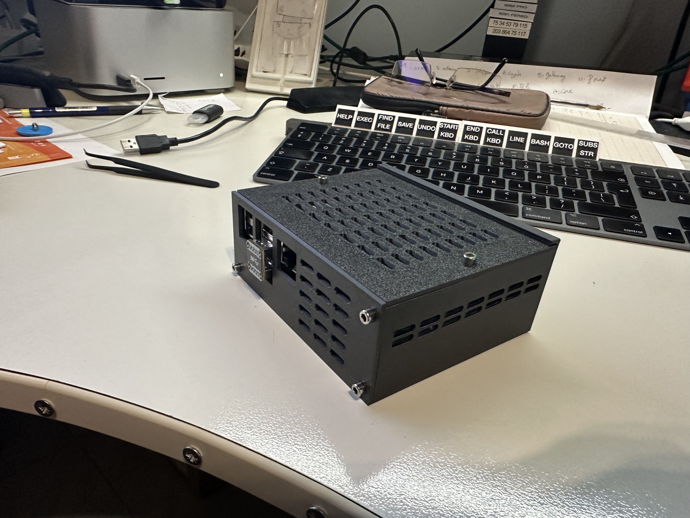
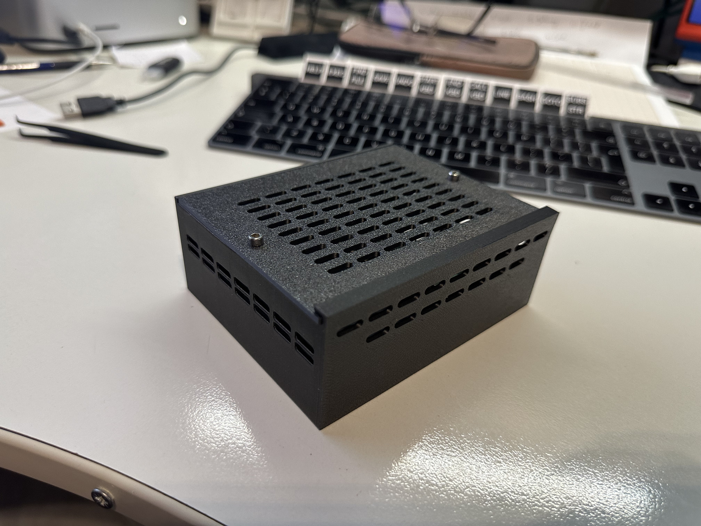
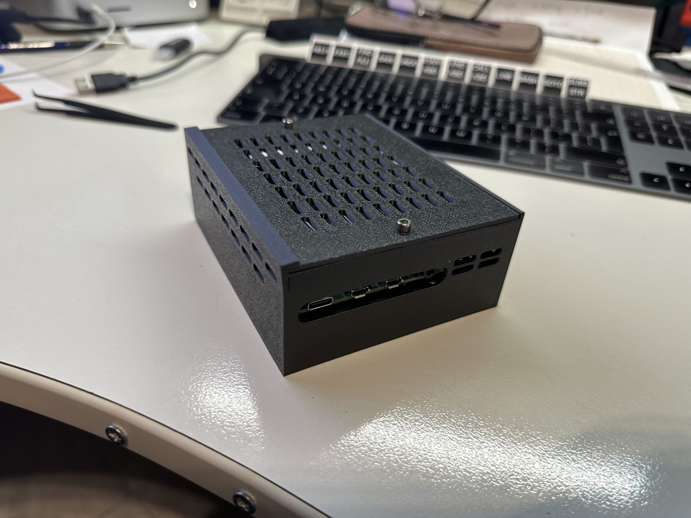

# X1100

The X1100 shield is a 2.5 inch SATA HDD/SSD expansion board, offering an easy and fast way to create bigger storage solution for your Raspberry Pi 5

I design a case to use it with a Raspberry Pi 4

# x1100-case

boitier-x1100-c1.scad, openscad source file.

STL files : 
* boitier-x1100-c1-boitier.stl
* boitier-x1100-c1-front.stl
* boitier-x1100-c1-top.stl

## OpenSCAD captures

## print

